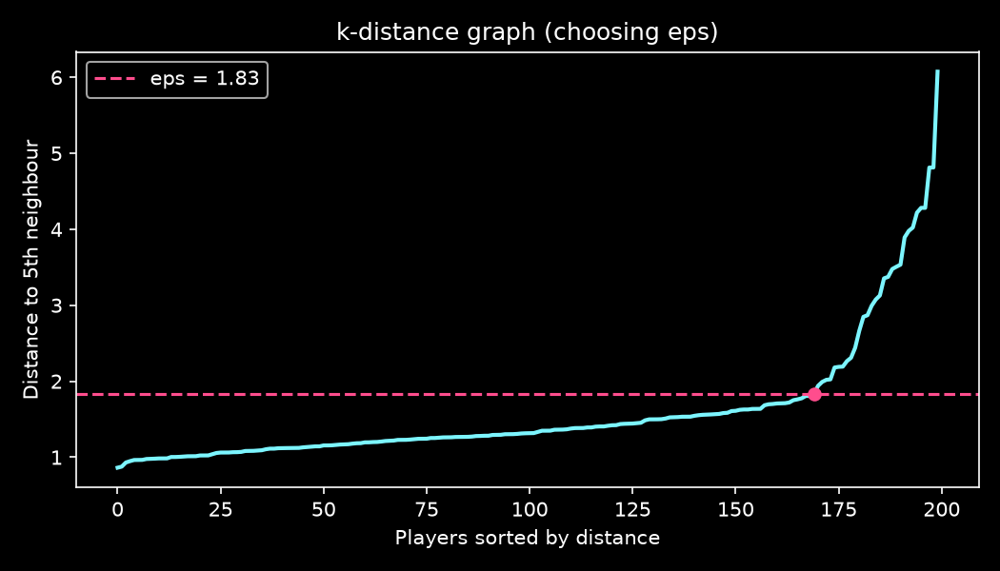
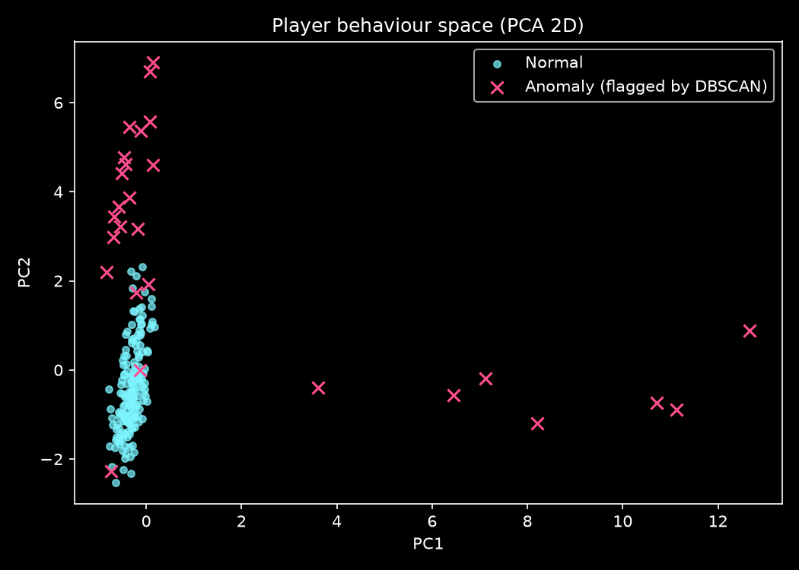
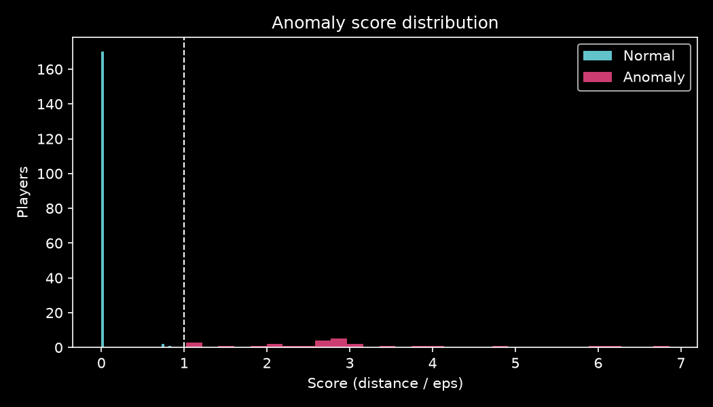
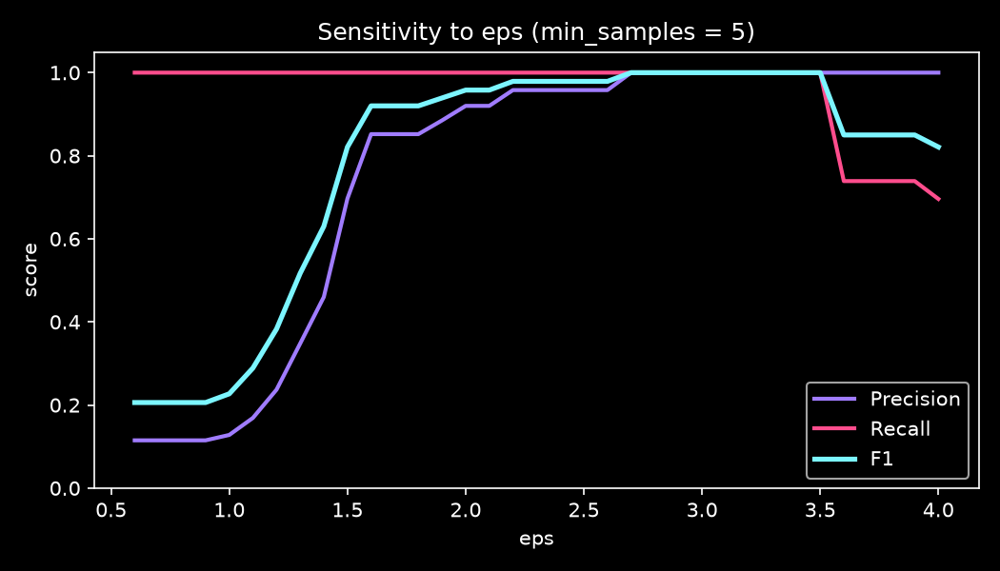
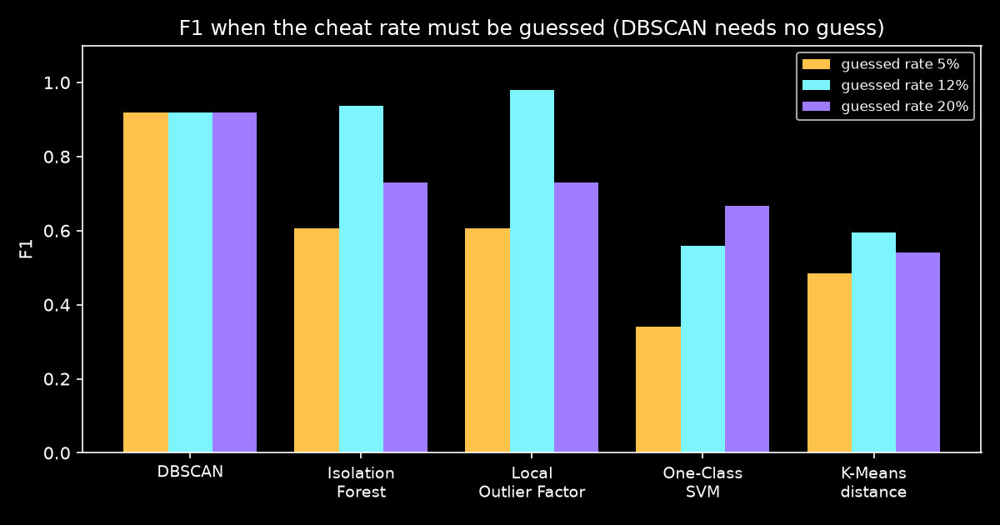

<div align="center">

# 🛡️ Sentinel AI

### Unsupervised cheat detection in multiplayer games using DBSCAN

**[🌐 Live Demo → sentinel-ai-detection.vercel.app](https://sentinel-ai-detection.vercel.app)**


*Pattern Recognition & Anomaly Detection — Topic 08: Player Behavior Anomalies*

</div>

---

## 📌 Problem Statement

> Use **DBSCAN** to cluster in-game movement coordinate data and isolate potential **automated aiming or cheating behavior** in multiplayer games.

Cheats such as aimbots, speedhacks and triggerbots leave behavioural traces that differ from how real humans move and aim. Sentinel AI learns what *normal* play looks like — **without ever being told who cheats** — and flags players whose behaviour falls outside dense regions of normal activity.

---

## ✨ What's Inside

| Feature | What it does |
|---|---|
| ☠️ **Beat Sentinel** | Red-team game: **design your own cheat** (aim lock, smoothing, auto-trigger, speed boost). It is dropped into **20 simulated matches**, run through the full pipeline and DBSCAN, and either **CAUGHT** or **UNDETECTED** — with a replay, a detection rate and a **Hall of Fame / Wall of Shame** leaderboard stored in the database |
| 🎬 **Match Replay Theatre** | Watch any of the 20 matches play back with all 10 players — play/pause, 1×/2×/4× speed, timeline scrubbing; flagged players glow |
| 🔴 **Live Scanner** | Enter a gamertag, match ID and gameplay stats — or upload raw match telemetry — and the backend returns a verdict (Clean / Review / High / Critical) with the reasons |
| 🗄️ **Scan database** | Every scan is stored in **SQLite** and shown in a live history table |
| 🧪 **Parameter Lab** | Move ε and min_samples and watch DBSCAN re-cluster — **210 precomputed runs** (sensitivity analysis) |
| ⚖️ **Benchmark** | DBSCAN vs Isolation Forest, LOF, One-Class SVM and K-Means — tested fairly with wrong guesses of the cheat rate |
| 🕵️ **Player dossiers** | Radar chart of feature deviations and a replay of each suspect's movement |
| 🗺️ **Live arena** | Animated map of all 200 players; flagged players glow |

---

## 🎯 Results at a Glance

| Metric | Score |
|---|---|
| **Recall** (cheaters caught) | **100%** — 23 / 23 |
| **Precision** (flags that were real cheaters) | **85.2%** — 23 / 27 |
| **F1 score** | **0.92** |
| **Accuracy** | **98.0%** — 196 / 200 |

| | Predicted normal | Predicted cheater |
|---|---|---|
| **Actual human** | 173 ✅ | 4 ⚠️ |
| **Actual cheater** | 0 | 23 ✅ |

**Recall by cheat type:** Aimbot 6/6 · Speedhack 7/7 · Triggerbot 10/10

> 💡 **Key insight:** all 4 false positives were *highly skilled human players* with anomaly scores between **1.02 and 1.44** — just past the normal boundary of 1.0. Every real cheater scored **≥ 1.98**. This gap supports a three-tier moderation policy: **Review** (1.0–1.8) → human moderator; **High / Critical** (≥ 1.8) → near-certain cheat.

---

## 🔬 Pipeline

```
Raw telemetry (60,000 ticks)
        │
        ▼
 1. Data preparation     → clean, de-duplicate, sort, treat structural missing values
        │
        ▼
 2. Feature extraction   → 10-dimensional behavioural fingerprint per player
        │
        ▼
 3. DBSCAN clustering    → StandardScaler + ε chosen from the k-distance knee
        │
        ▼
 4. Anomaly scoring      → distance to nearest normal core point ÷ ε
        │
        ▼
 5. Evaluation           → hidden labels revealed only now: P / R / F1 / confusion matrix
```

---

## 📊 1. Dataset

Simulated multiplayer telemetry sampled at **10 Hz**.

| Property | Value |
|---|---|
| Rows (ticks) | 60,000 |
| Players | 200 (20 matches × 10 players) |
| Ticks per player | 300 (~30 seconds) |
| Raw columns | 15 |

**Population:** 177 humans · 6 aimbots · 10 triggerbots · 7 speedhackers (~11.5% cheaters)

To make the data **realistic rather than perfectly separable**, every player has a personality:
- Humans have a **skill level** — some pros aim well and react fast, so they *look* suspicious.
- Aimbots have a **lock strength** — some are subtle “closet” cheaters that humanise their aim.

**Raw columns:** `match_id`, `player_id`, `tick`, `pos_x`, `pos_y`, `speed`, `yaw`, `pitch`, `yaw_delta`, `enemy_visible`, `is_firing`, `reaction_ms`, `is_hit`, `is_headshot`, `true_label`

> ⚠️ `true_label` is **never** given to the model. DBSCAN is fully unsupervised; labels are used **only** in the evaluation stage.

**Preprocessing:** duplicate removal, sorting by player & time, and handling of `reaction_ms`, which is empty on 88.2% of ticks. This is *structural* missingness (reaction time only exists when a player fires), so it is kept as missing at tick level and aggregated per player.

---

## 🧬 2. Feature Engineering

Each player's 300 ticks are compressed into a **10-feature behavioural fingerprint**:

| # | Feature | What it captures | Cheat it exposes |
|---|---|---|---|
| F01 | `mean_speed` | Average movement speed | Speedhack |
| F02 | `max_speed` | Peak speed vs. the game's cap | Speedhack |
| F03 | `speed_std` | Speed variability | Speedhack |
| F04 | `snap_angle` | Aim rotation when an enemy appears | Aimbot |
| F05 | `aim_jitter` | Crosshair micro-shake while idle | Aimbot |
| F06 | `reaction_mean` | Average reaction time (ms) | Triggerbot / Aimbot |
| F07 | `reaction_std` | Reaction-time consistency | Triggerbot |
| F08 | `hit_rate` | Shots that land | Aimbot / Triggerbot |
| F09 | `headshot_rate` | Hits that are headshots | Aimbot |
| F10 | `path_straightness` | Net displacement ÷ distance travelled | Movement bots |

All features are standardised with `StandardScaler` so each contributes equally to DBSCAN's distance calculations.

---

## 🧠 3. Anomaly Detection with DBSCAN

**Why DBSCAN?**
- **No labels needed:** it is unsupervised.
- **No need to choose the number of clusters.**
- **Built-in outlier detection:** points in low-density regions are labelled *noise* (`-1`).
- Honest players are *many and similar* → a dense core. Cheaters are *few and strange* → noise.

**Choosing ε (eps):** the **k-distance graph** (k = `min_samples` = 5). Each player's distance to its 5th nearest neighbour is sorted, and ε is set at the **knee** (the point of maximum curvature), where density drops off sharply.

| Parameter | Value |
|---|---|
| ε (eps) | 1.831 |
| min_samples | 5 |
| Normal clusters found | 1 |
| Players flagged | 27 |

**Micro-clusters:** clusters smaller than 10% of players are also treated as anomalous. Cheaters using the *same tool* can form a tiny dense group of their own, and this rule catches them.

<p align="center"> </p>

---

## 📈 4. Anomaly Scoring

```
anomaly_score = distance to nearest core point of a normal cluster ÷ ε
```

- **≤ 1.0** → inside normal behaviour
- **> 1.0** → outside it; the larger the score, the stranger the player

Each flagged player is also given a **top reason**: the feature with the largest |z-score|, which explains *why* they were flagged.

<p align="center"></p>

---

## ✅ 5. Evaluation & Interpretation

- **Every cheater was caught** (recall 100%) across all three cheat types.
- **4 false positives:** skilled humans sitting just outside the normal boundary.
- The **score gap** between the highest false positive (1.44) and the lowest cheater (1.98) shows the score is a meaningful risk measure, not just a yes/no flag.

### 🧪 Sensitivity analysis (Parameter Lab)

DBSCAN was re-run **210 times** over ε ∈ [0.6, 4.0] × min_samples ∈ {3, 4, 5, 6, 8, 10}.
- ε too small → almost everyone is “noise” (F1 ≈ 0.2).
- ε too large → cheaters are absorbed into the normal cluster and missed.
- The label-free **knee** choice (ε = 1.83) gives F1 = 0.92. A slightly larger ε reaches 1.00, but choosing ε *using the labels* would be **data leakage**, so the knee is the honest choice.

<p align="center"></p>

### ⚖️ Benchmark vs other detectors

Every other method needs its **contamination** (the expected cheat rate) set in advance — a number nobody knows in real life. Each was therefore tested with a low (5%), near-correct (12%) and high (20%) guess:

| Method | Needs cheat rate? | F1 @5% | F1 @12% | F1 @20% | Worst case |
|---|---|---|---|---|---|
| **DBSCAN** | **No** | **0.92** | **0.92** | **0.92** | **0.92** |
| Isolation Forest | Yes | 0.61 | 0.94 | 0.73 | 0.61 |
| Local Outlier Factor | Yes | 0.61 | 0.98 | 0.73 | 0.61 |
| One-Class SVM | Yes | 0.34 | 0.56 | 0.67 | 0.34 |
| K-Means distance | Yes | 0.48 | 0.60 | 0.54 | 0.48 |

> Given the *exact* rate, LOF and Isolation Forest score slightly higher — but when the guess is wrong they drop to 0.61. **DBSCAN has the best average and best worst-case F1**, because it finds the outliers itself.

<p align="center"></p>

---

## 🔴 Live Scanner — Backend & Database

```
 Website  ──fetch/JSON──►  Flask REST API  ──SQL──►  SQLite (backend/sentinel.db)
                              │
                              └── DBSCAN model trained on data/processed/player_features.csv
```

A new player is scored exactly like the reference players: standardise the 10 features, find the nearest **core point of the normal cluster**, divide the distance by ε. The scan and its verdict are saved to the `scans` table.

| Method | Endpoint | Purpose |
|---|---|---|
| GET | `/api/health` | Server status, number of saved scans |
| GET | `/api/model` | ε, min_samples, feature ranges, demo presets |
| POST | `/api/scan` | Score a player from 10 feature values → saved |
| POST | `/api/scan/upload` | Upload raw telemetry `.csv` → same feature extraction as the pipeline → saved |
| GET | `/api/scans` | Scan history |
| POST | `/api/challenge` | Beat Sentinel: simulate 20 matches with a user-designed cheat → detection rate, advantage, replay → saved |
| GET | `/api/leaderboard` | Hall of Fame (undetected cheats) and Wall of Shame (caught) |
| GET | `/api/stats` | Counts per verdict |
| DELETE | `/api/scans` | Clear history |

### ☠️ Beat Sentinel — what it shows

| Cheat loadout | Detection rate | Advantage |
|---|---|---|
| Honest (no cheat) | 0% | — |
| Rage aimbot | 100% | +118% |
| Closet cheater (weak aim + smoothing) | ~20% | ~+14% |

**Insight:** Sentinel catches every cheat strong enough to matter. The only cheats that slip through give a tiny advantage — DBSCAN forces cheaters to play almost like humans.

---

## 🏁 Conclusion

Density-based clustering can separate honest play from cheating **without any labelled data**. DBSCAN combined with engineered behavioural features achieved **100% recall and 0.92 F1**. Treating small clusters as suspicious extends detection from lone outliers to **coordinated cheaters sharing the same tool**.

### ⚠️ Limitations
- Synthetic telemetry: real games add network lag, map geometry and team play.
- A single global ε assumes one density; mixed skill brackets may need several.
- Elite human players sit near the boundary and can be flagged.
- Batch analysis: scores are computed after a match, not live.

### 🚀 Future Improvements
- **HDBSCAN** for variable density across ranks and regions.
- **Sequence features** (e.g. LSTM embeddings) of aim trajectories.
- **Streaming detection** during live matches, with a moderator review queue.
- Validation on **real, labelled** anti-cheat datasets.

---

## 🗂️ Project Structure

```
sentinel-ai-player-anomaly-detection/
├── backend/
│   ├── generate_data.py      # synthetic telemetry generator
│   ├── pipeline.py           # preprocessing → features → DBSCAN → scoring → evaluation → benchmark
│   ├── app.py                # Flask REST API + SQLite database + serves the website
│   ├── sentinel.db           # created automatically: every scan is stored here
│   └── requirements.txt
├── data/
│   ├── raw/                  # player_telemetry.csv (60,000 rows)
│   └── processed/            # player_features.csv (200 players × features + scores)
├── docs/
│   └── figures/              # k_distance, pca_clusters, score_hist, eps_sensitivity, benchmark
└── frontend/                 # interactive website (HTML / CSS / JS, no frameworks)
    ├── index.html
    ├── styles.css
    ├── app.js
    ├── config.js             # where the site finds the backend
    └── public/
        ├── data/results.json
        └── samples/          # sample telemetry files for the upload scanner
```

---

## ▶️ How to Run

```bash
# 1. Install dependencies
pip install -r backend/requirements.txt

# 2. Generate the dataset
python backend/generate_data.py

# 3. Run the full pipeline (writes CSVs, plots and website data)
python backend/pipeline.py

# 4. Start the backend (API + database + website)
python backend/app.py
# open http://localhost:5000
```

---

## 🛠️ Tech Stack

**Python** · **pandas** · **NumPy** · **scikit-learn** (DBSCAN, StandardScaler, PCA, NearestNeighbors, IsolationForest, LOF, One-Class SVM, K-Means) · **Matplotlib** · **Flask** (REST API) · **SQLite** · **HTML / CSS / JavaScript** (hand-built SVG & Canvas visualisations) · **Vercel**

---

<div align="center">

**Built by Jagruti Patel**
Pattern Recognition & Anomaly Detection

</div>
